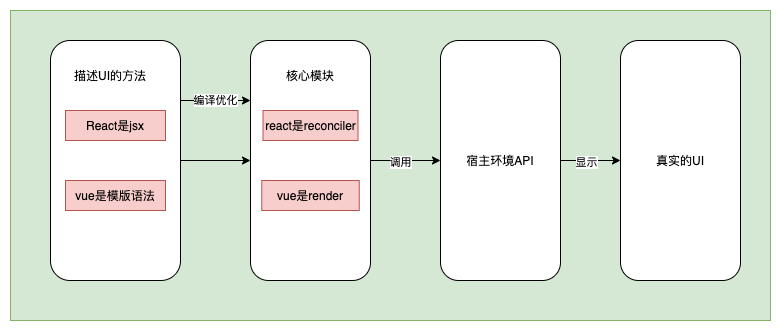
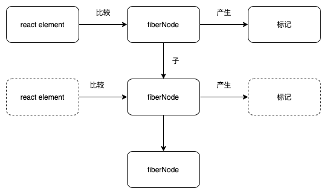

reconciler 协调器

reconciler 有什么作用？



react 是使用的 jsx react 没有编译优化的过程 所以 react 是一个纯运行时的前端框架 开放不同环境通用的 宿主环境 api 所以 react 支持多种环境
vue 是模版语法 vue 是有编译优化的过成

## 核心模块使用 jsx 的过程

react element

1. 无法表达节点之前的关系 只能表示当前节点和内部节点之前的一个关系
2. 没有字段表示状态的变化 字段有限

所以需要一个新的数据结构 就是 fiber Node 就是虚拟 dom 在 react 中的实现 特点是

1. 介于 react element 和真实 UI 之间
2. 能够表达节点之间的关系
3. 方便拓展 不仅能作为数据存储单元 也可以作为工作单元

梳理一下 几种节点类型

1. jsx 开发编写的 类似的 `<div>11</div>` 就是 jsx
2. reactElement babel 转化后就是 reactElement
3. FiberNode
4. 真实 dom

fiberNode 需要的节点

```js
import { Props, Key, Ref } from 'shared/ReactTypes';
import { WorkTag } from './workTags'; // 定义节点类型

export class FiberNode {
	key: Key;
	tag: WorkTag;
	pendingProps: Props;
	memoizedProps: Props | null;
	stateNode: any;
	type: any;
	return: FiberNode | null;
	sibling: FiberNode | null;
	child: FiberNode | null;
	index: number;
	ref: Ref;

	constructor(tag: WorkTag, pendingProps: Props, key: Key) {
		// 对于fiberNode来说 这个是实例属性
		this.tag = tag;
		this.key = key;
		// 举个例子 比如当前节点类型是 HostComponent  <div> 那么就是保存当前div 这个dom
		this.stateNode = null;
		// fiberNode的类型 例如 FunctionComponent 代表就是本身
		this.type = null;

		// 构成树状结构
		// 指向父fiberNode 为什么叫return 因为我们把fiberNode当作一个工作单元 当一个工作单元完成以后 下一个就是父工作单元 所以是return
		this.return = null;
		// 指向兄弟 fiberNode
		this.sibling = null;
		// 指向子fiberNode
		this.child = null;
		// 指向同级的 fiberNode 举个例子 一个ul下面有多个li 那么 index 则代表这个li的下标顺序
		this.index = 0;

		this.ref = null;

		// 作为工作单元
		// 工作单元刚开始工作时 props是什么
		this.pendingProps = pendingProps;
		// 工作单元结束以后 确定的单元props是什么
		this.memoizedProps = null;
	}
}
```

## reconciler 的工作方式

对于同一个节点 比较其 ReactElement 与 FiberNode 生成子的 fiberNode 并根据比较结果生成不同的标记，
例如 插入 删除 移动

例如下图


举个例子

例子 1: 插入一个 div

首先是写一了一个 jsx 然后经过 jsx 方法转化 变成了 ReactElement

所以 ReactElement 对应 jsx('div')

因为是插入 所以没有 fiberNode

所以 fiberNode 对应 null

生成子的 fiberNode

产生标记 Placement

例子 2: 把 div 标签 替换成 p 标签

首先经过 jsx 方法转化 ReactElement 对应 jsx('p')

对应的 fiberNode 是 FiberNode {type:'div'}

比较之后 产生一个子的 fiberNode

产生两个标记 Deletion（因为类型不同所以要先删除） Placement（然后再插入）

### 双缓存

当 reactElement 比较完全后 会生成一颗 fiberNode 树，一共会存在两颗 fiberNode 树

- current 视图中真实 UI 对应的 fiberNode
- workInProgress 触发更新后 正在 reconciler 计算的 fiberNode 树 结束后 会变成 current 树

会使用 alternate 来回转化两颗树

## jsx 的消费顺序

深度优先遍历（DFS）

```html
<div>
	<h1>标题</h1>
	<p>测试</p>
</div>
```

先遍历 div 然后再遍历 h1 有子节点 遍历子节点 标题文本 没有子节点 找兄弟节点 也没有兄弟节点 然后到 h1
然后找 兄弟节点 p 遍历完 再找子节点 测试文本 然后没有子节点 也没有兄弟节点 然后到 p 再找 没有兄弟节点 然后到 div

递归的过程
如果有子节点 那么遍历子节点 如果没有 那么遍历兄弟节点

这个递归的过程 存在两个阶段

- 递 beginWork

- 归 completeWork
